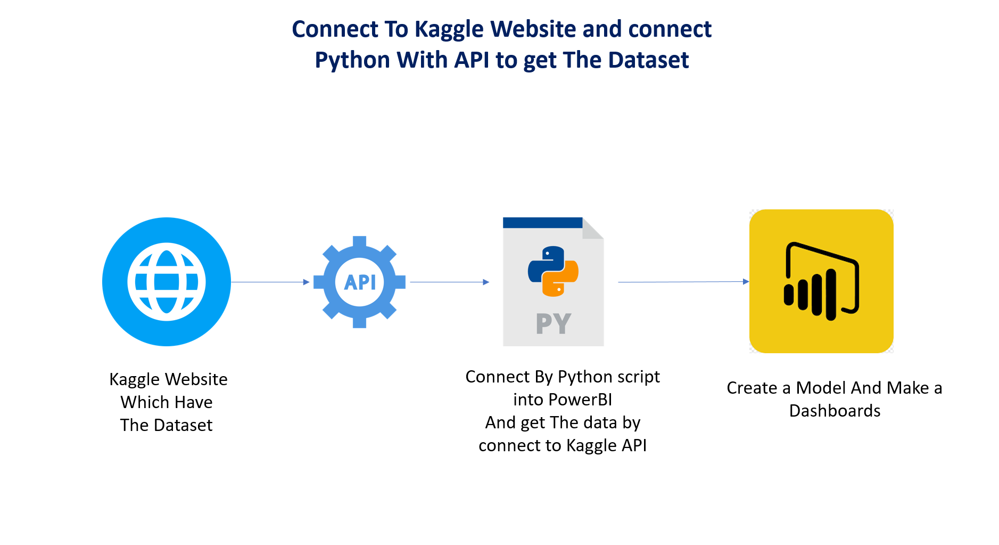

# Kaggle-API-project-of-US-flight
# ✈️ US Flights 2015 - Power BI Dashboard

## 📊 Project Overview

This project visualizes flight data from the year 2015 using **Power BI**, providing insights into flight numbers, delays, cancellations, and airline performances across the United States. The dataset is sourced from Kaggle, and I've used a custom Python script to connect the Kaggle API and load the data into Power BI.

---

## 🔧 Tools & Technologies

- **Power BI**: For data visualization and dashboard creation
- **Python**: To connect and extract data using the Kaggle API
- **Kaggle API**: Used to fetch the US Flights 2015 dataset
- **GitHub**: For version control and collaboration

---

## 🚀 Features

- **Flight Statistics**: Visualizing flight numbers by month and day of the week
- **Top Destinations**: Analysis of the busiest airports and flight routes
- **Cancelled Flights**: Breakdown by airline, weather, and system delays
- **Flight Delays**: Analysis of arrival, departure, and weather-related delays
- **Key Metrics**:
  - 89.88K cancelled flights
  - 5.73M completed flights
  - 322 airports covered

---

## 📁 Project Files

- **Kaggle API Python Script**: [`kaggle_api_connect.py`](Connect)
- **Screenshots**: Available in the [Images](Dashboards) folder

---
## 🛠️ How to Connect to the Kaggle API

Below are the steps to connect to the Kaggle API to download the dataset. Follow these steps to set up your environment:



---

## 🔗 Kaggle Dataset

The dataset used in this project can be found on Kaggle: [US Flights 2015 Dataset](https://www.kaggle.com/datasets/usdot/flight-delays)

---

## 📝 How to Use

1. **Download the Repository**:
   Clone this repository using:
   ```bash
   git clone https://github.com/yourusername/US-Flights-2015-Dashboard.git
